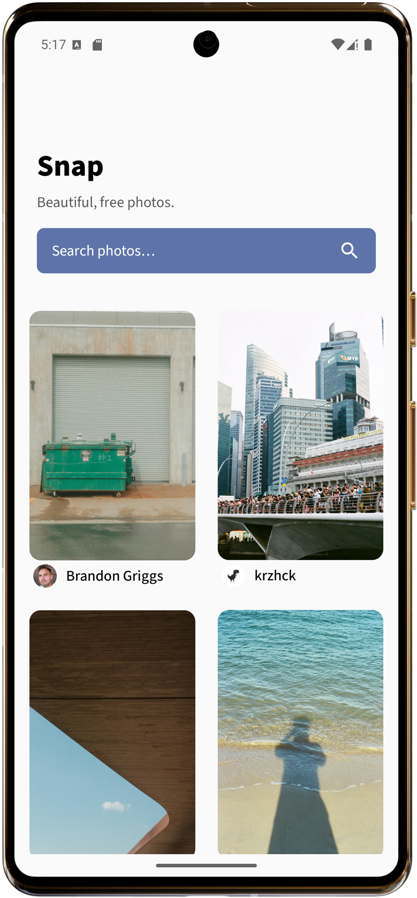
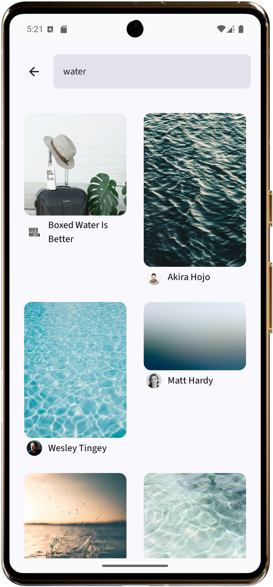
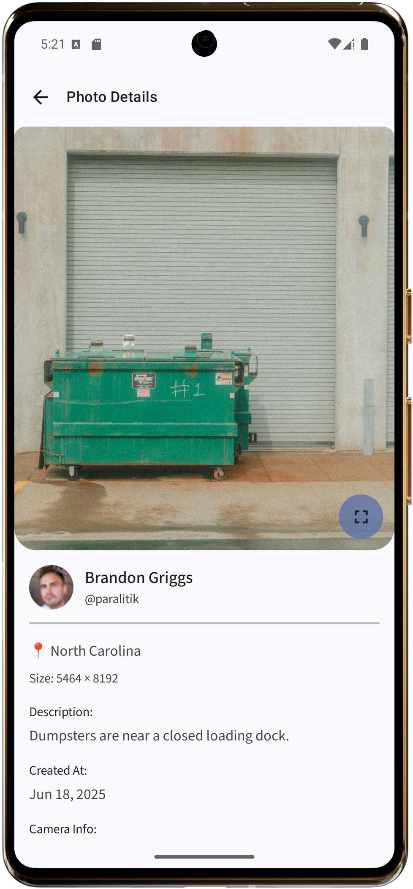
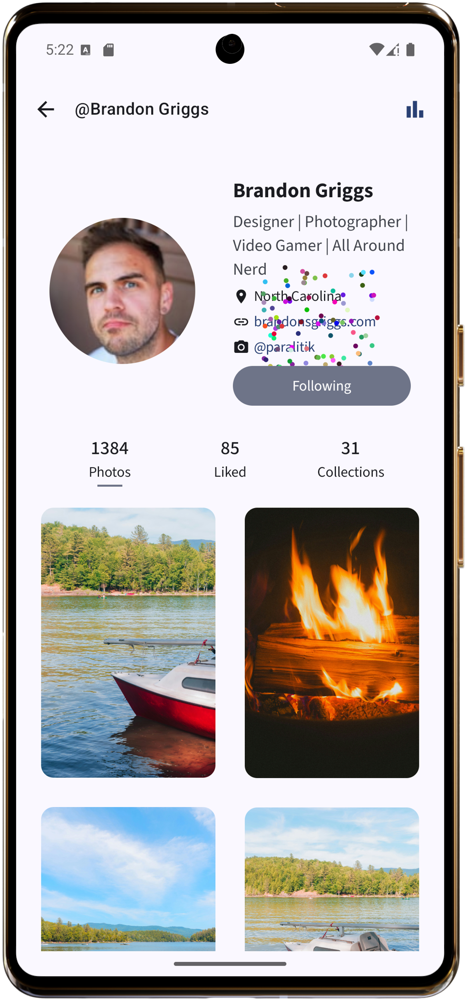

# 📸 ComposeGallery

A modern Android app built with **Jetpack Compose**, showcasing best practices and clean architecture while consuming the **Unsplash API**. This project highlights advanced UI, pagination, dependency injection, and architecture patterns.

---

## 🚀 Features

- 🔍 **Search Unsplash photos** with infinite scroll
- 📷 **Photo details** with metadata, exif, and location info
- 👤 **User profile** with statistics, photos, liked images & collections
- 📂 **Collection viewer**
- 🌑 **Jetpack Compose UI** with Material 3 styling
- 💉 **Hilt Dependency Injection**
- 🌐 **Retrofit-based API integration**
- 🧪 **Unit & UI tests (in progress)**
- 🎯 **Built for performance and readability**

---

## 🧱 Tech Stack

- **UI**: Jetpack Compose, Material 3
- **Architecture**: MVVM + Clean Architecture
- **Dependency Injection**: Hilt
- **Networking**: Retrofit + Kotlinx Serialization
- **Pagination**: Paging 3
- **Asynchronous**: Kotlin Coroutines + Flow
- **Testing**: JUnit, Mockito, Turbine, Compose UI Testing (WIP)
- **Build**: Gradle (KTS), GitHub Actions (WIP)

---

## 📷 Screenshots

| Gallery Screen        | Search Screen         | Photo Detail         | User Profile          |
|------------------------|------------------------|-----------------------|------------------------|
|  |  |  |  |

---

## 🎨 UI/UX Craftsmanship

This app demonstrates attention to smooth user experiences with:

- Confetti animation to celebrate actions
- Shared element transitions for visual continuity
- Compose animation APIs like `AnimatedVisibility`, `Crossfade`, `updateTransition`, `Animatable `
- Responsive staggered grid layout for the gallery, adapting to screen size (similar to Pinterest-style layouts)

---

## 🔑 Unsplash API Key Required

This project **requires an Unsplash API key** to function properly. Without it, images will not load.

### How to Get an API Key:
1. Visit [Unsplash Developers](https://unsplash.com/developers) and create an account.
2. Register a new application to receive your **Access Key**.
3. This key is necessary for authentication when fetching images from the Unsplash API.

### How to Provide the API Key:
Create a `local.properties` file at the **root of the project** (next to your `gradlew` file), and add the following line:

UNSPLASH_ACCESS_KEY=your_actual_unsplash_access_key_here

---

## 📂 Project Structure

```plaintext
java/
└── com/example/composegallery/
    ├── feature/gallery/                    # Gallery feature and its sub-features
    │   ├── data/                            # Data layer (API, database, paging sources, repositories)
    │   │   ├── di/                          # Dependency injection (Hilt modules, providers)
    │   │   ├── local/                       # Local storage (Room DAOs, entities)
    │   │   ├── model/                       # Network and database models (DTOs)
    │   │   ├── pagingsource/                # Paging sources for infinite scroll
    │   │   ├── remote/                      # Remote APIs (Retrofit interfaces)
    │   │   ├── repository/                  # Repository implementations
    │   │   └── util/                        # Utilities, error handling, network results
    │   ├── domain/                          # Domain layer (clean architecture)
    │   │   ├── model/                       # Domain models (entities used by UI)
    │   │   ├── repository/                  # Repository interfaces
    │   │   └── usecase/                     # Use cases (business logic)
    │   └── ui/                              # UI layer (screens, components, ViewModels)
    │       ├── common/                      # Shared UI components across screens
    │       ├── gallery/                     # Gallery screen and components
    │       ├── navigation/                  # App navigation graph and route definitions
    │       ├── photodetail/                 # Photo detail screen and ViewModel
    │       ├── profile/                     # User profile screen, stats, charts, confetti
    │       ├── search/                      # Search screen and related components
    │       └── util/                        # UI utilities (blurhash decoder, UIState)
    ├── ui.theme/                            # App theme (colors, typography, shapes)
    ├── GalleryApplication.kt                # Application class (Hilt setup, global config)
    └── MainActivity.kt                      # Main activity, entry point for Compose

res/
├── drawable/                                # Image assets
├── drawable-hdpi/                           # HDPI image assets
└── values/                                  # Strings, colors, styles, themes
    └── strings.xml

```

