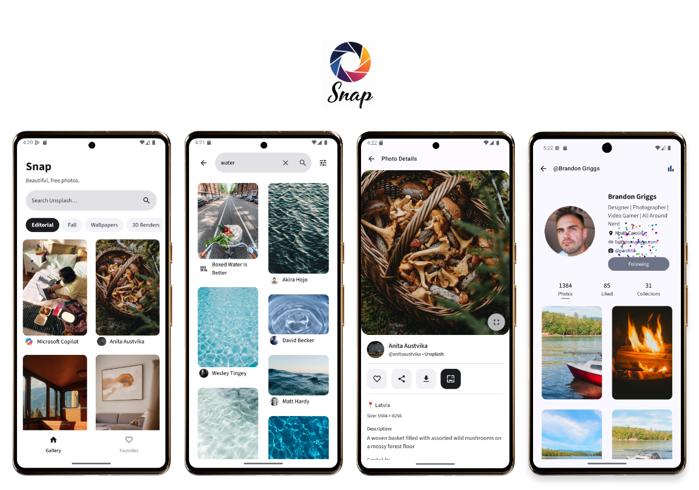

# 📸 ComposeGallery

A modern Android app built with **Jetpack Compose**, showcasing best practices and clean architecture while consuming the **Unsplash API**. This project highlights a robust **multi-module architecture**, advanced UI, pagination, and dependency injection.

---

## 📷 Screenshots



---

## 🚀 Features

- 🏗️ **Multi-Module Architecture**: Scalable, decoupled structure separating features and core logic for better build performance and maintainability.
- 🔍 **Search Unsplash photos** with infinite scroll and **advanced filters** (Orientation, Color, Sorting)
- ❤️ **Favorites System**: Save your favorite photos locally with persistent storage
- 🔄 **Daily Pre-fetch**: Background background task to keep "Editorial" photos up-to-date using **WorkManager**
- ☁️ **Offline-First**: Robust caching strategy using Room and Paging 3 Mediator for seamless offline viewing
- 📥 **Photo Download**: High-quality photo downloads with **real-time progress tracking** and MediaStore integration
- 🖼️ **Set Wallpaper**: Quickly set any Unsplash photo as your device wallpaper
- 🕒 **Recent Searches**: Persistent search history management (view, reuse, or clear)
- 📤 **Photo Sharing**: Share high-resolution images directly to other apps (WhatsApp, Instagram, etc.) with secure **FileProvider** integration
- 📷 **Photo details** with metadata, exif, and location info
- 👥 **User profile** with statistics, photos, liked images & collections
- 🌑 **Jetpack Compose UI** with Material 3 styling
- 💉 **Hilt Dependency Injection**
- 🌐 **Retrofit-based API integration**
- 🧪 **Unit & Instrumented tests** covering all layers
- 🎯 **Built for performance and readability**

---

## 🧱 Tech Stack

- **UI**: Jetpack Compose, Material 3, Shimmer (valentinilk), BlurHash (woltapp)
- **Architecture**: Multi-module MVVM + Clean Architecture  
- **Dependency Injection**: Hilt  
- **Networking**: Retrofit + Kotlinx Serialization  
- **Pagination**: Paging 3 (RemoteMediator for offline-first support)
- **Local Storage**: Room Database (Caching, Favorites, Search History)
- **Image Loading**: Coil
- **Build System**: Gradle (KTS) with **Convention Plugins** for modular configuration
- **Performance**: **Baseline Profiles** for improved startup and frame stability
- **System Integration**: DownloadManager, MediaStore API, WallpaperManager, FileProvider
- **Logging**: Timber  
- **Code Quality**: Spotless (formatting), Detekt (static analysis)  
- **Testing**: JUnit, Mockito, Turbine, Truth, Compose UI Testing

---

## 🎨 UI/UX Craftsmanship

This app demonstrates attention to smooth user experiences with:

- **Shared Element Transitions**: Seamless visual continuity when navigating between the gallery, search, and user profiles across module boundaries.
- **Progressive Image Loading**: Instant "flicker-free" transitions using cached thumbnails that upscale to high-resolution in the background with localized progress indicators.
- **Namespaced Animations**: Smart transition logic that isolates animations to specific navigation stacks, preventing visual "swapping" during complex navigation flows.
- **Confetti Celebration**: Interactive confetti animations to reward specific user actions (e.g., following a user).
- **Responsive Staggered Grid**: Adaptive Pinterest-style layouts that adjust column counts based on device size and orientation.
- **Gesture Support**: Immersive photo viewing with full support for panning and zooming gestures.
- **Empathetic Error Handling**: Custom error mapping that converts technical network/API errors into human-readable, actionable messages.

---

## 🔑 Unsplash API Key Required

This project **requires an Unsplash API key** to function properly. Without it, images will not load.

### How to Get an API Key:
1. Visit [Unsplash Developers](https://unsplash.com/developers) and create an account.
2. Register a new application to receive your **Access Key**.

### How to Provide the API Key:
Create a `local.properties` file at the **root of the project**, and add the following line:

UNSPLASH_API_KEY=your_actual_unsplash_access_key_here

---

## 📂 Project Structure

The project is organized into logical layers and features using a multi-module approach:

```plaintext
java/
├── app/                                     # Main application entry point & DI configuration
├── baselineProfile/                         # Baseline Profile generation & Macrobenchmark tests
├── build-logic/                             # Gradle convention plugins (reusable build logic)
├── core/                                    # Shared foundational modules
│   ├── common/                              # Generic utilities, base classes, and Result types
│   ├── database/                            # Room setup, entities, and DAOs for offline persistence
│   ├── domain/                              # Business logic, use cases, and repository interfaces
│   ├── network/                             # Networking setup (Retrofit, API models, Interceptors)
│   ├── navigation/                          # Centralized navigation logic and route definitions
│   └── ui/                                  # Shared UI components, theme, and Responsive Layouts
└── feature/                                 # Feature-specific isolated modules
    ├── <feature_name>/                      # Typical internal feature structure:
    │   ├── data/                            #   - Feature-specific repositories and data sources
    │   ├── domain/                          #   - Feature-specific use cases (where applicable)
    │   └── ui/                              #   - Compose screens, components, and ViewModels
    ├── home/                                # Main gallery feed, topics, and favorites management
    ├── photodetail/                         # Detailed photo view, metadata, high-res download, and sharing actions
    ├── profile/                             # User profiles, statistics, and interactive charts
    └── search/                              # Search functionality with advanced filter options
```

---

## ⚡ Performance Optimization

This project uses **Baseline Profiles** to ensure the best possible user experience from the first launch.

- **Startup Latency**: Optimized to reduce "Time to Initial Display" (TTID) by pre-compiling critical code paths.
- **Jank Reduction**: Smooth scrolling and transitions are achieved by capturing and optimizing frequently used UI paths.

### Generating a new Profile:
If you make significant changes to the UI or navigation logic, you should regenerate the profile using the provided run configuration:
1. Select **`Generate Baseline Profile`** from the run configurations dropdown.
2. Click **Run**.

You can verify the performance gains by running the **`Run Startup Benchmarks`** configuration, which compares the app's startup time with and without the profile.

---

## 🧪 Testing

The app is thoroughly tested at multiple levels:
- **Unit Tests**: Over 70 tests covering ViewModels, Use Cases, Repositories, and Data Mappers.
- **Instrumented Tests**: 20+ tests verifying Room DAOs, Paging Mediator, and UI components in an Android environment.
- **Architecture**: Designed for testability using constructor injection and repository patterns.
